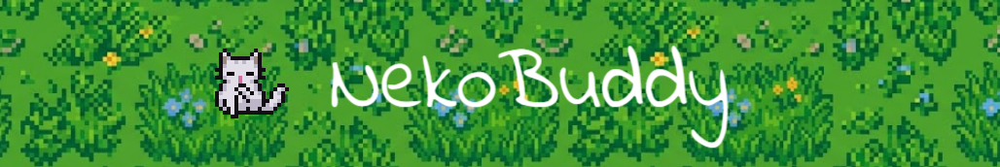

<p align="center">
  
</p>

> **Developed by Owen ([@Brauxo](https://github.com/Brauxo))**  
> *Huge thanks to **Last tick** for the incredible pixel art assets used in this project! Make sure to check out his [itch.io profile here](https://last-tick.itch.io/) to support his work!*

A retro desktop companion powered by any LLM.

NekoBuddy is a virtual cat that lives on your computer desktop. Instead of relying on hardcoded scripts, it uses a dual-agent architecture to act as a context-aware companion. Thanks to `litellm` under the hood, NekoBuddy can run completely locally and privately via Ollama, or connect to any major cloud provider (OpenAI, Anthropic, Gemini) by simply typing the model name. It reads your active window titles and spontaneously interacts with you based on your workflow.

---

<h2></h2>

- **Dual-Agent Architecture**: Built with a foreground `ChatAgent` for direct conversation and a background `MoodAgent` that proactively evaluates your desktop context.
- **Context-Aware**: Reads your active window titles to provide relevant commentary on whatever application you are currently using.
- **Local or Cloud AI**: Runs 100% offline via Ollama for privacy, but seamlessly supports 100+ cloud providers (OpenAI, Anthropic, Google) thanks to LiteLLM.
- **Customizable**: Right-click the companion to change its sprite color, name, and hot-swap the local LLM model on the fly.
- **State Machine Physics**: Fully animated PySide6 frameless window that transitions between idle, walking, sleeping, washing, and yawning states based on an internal mood probability engine.

---

<h2></h2>

### Prerequisites
1. Install [uv](https://github.com/astral-sh/uv) (Python package manager)
2. Ensure `make` is installed on your system.
3. *(Optional)* Install [Ollama](https://ollama.com/) if you want to run local models.

### Installation

Clone the repository and run the setup command:

```bash
git clone https://github.com/Brauxo/NekoBuddy.git
cd NekoBuddy
make setup
```
*(This automatically installs dependencies via `uv sync` and pulls the recommended default model from Ollama.)*

### Running the App

```bash
make run
```

---

<h2></h2>

Thanks to LiteLLM, you can use any model provider just by typing the standard prefix into the NekoBuddy Settings Menu (e.g., `openai/gpt-4o`). If using a cloud provider, simply add your API key to the `.env` file.

**Local Models (via Ollama):**
I highly recommend using [**`gemma4`**](https://ollama.com/library/gemma4) (or any state-of-the-art local model with computer vision capabilities). This guarantees the fastest performance and supports future updates where the pet can visually "see" your screen!

---

<h2></h2>

1. **Move**: Click and drag the cat anywhere on your screen.
2. **Chat**: Right-click and select "Talk to Cat" to initiate a conversation. The LLM maintains persistent memory of your chats.
3. **Settings Dialog**: Right-click the cat to open the visual configuration menu. From here, you can instantly hot-swap the LLM model, change the cat's sprite color, or edit names/chat colors.
4. **.env Configuration**: All of your settings are automatically saved to a `.env` file in the root directory. If you prefer, you can manually edit this `.env` file to configure your `OPENAI_API_KEY` (if using cloud models) or manually tweak variables before starting the app!

---

<h2></h2>

This project is actively being improved! I am completely open to changes, improvements, and new ideas. 

If you want to see a specific feature added (like interactive petting or letting the cat open apps for you), please open a thread in the **Discussions** or **Issues** tab on GitHub!

---
